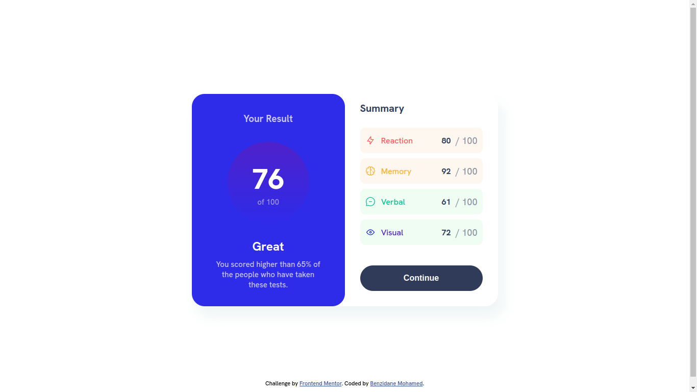

# Frontend Mentor - Results summary component solution

This is a solution to the [Results summary component challenge on Frontend Mentor](https://www.frontendmentor.io/challenges/results-summary-component-CE_K6s0maV). Frontend Mentor challenges help you improve your coding skills by building realistic projects. 

## Table of contents

- [Overview](#overview)
  - [Screenshot](#screenshot)
  - [Links](#links)
- [My process](#my-process)
  - [Built with](#built-with)
  - [What I learned](#what-i-learned)
- [Author](#author)

## Overview

### Screenshot

### Links

- Solution URL: [solution URL here](https://github.com/BenzidaneMo/results-summary-component)
- Live Site URL: [live site URL here](https://benzidanemo.github.io/results-summary-component/)

## My process

### Built with

- Semantic HTML5 markup
- CSS custom properties

### What I learned

During the development of the results summary component, I utilized div and nested div elements to structure and style the component. This involved setting widths, heights, and margins for each div to achieve the desired layout.

One of the main challenges I encountered was making the component responsive using **media queries**. I struggled to make the div elements adjust their widths and heights dynamically based on the screen size. However, after researching and experimenting with various techniques, I was able to successfully implement media queries to ensure that the component looks good on screens of all sizes.

Overall, this project taught me the importance of using div elements and how they can be nested to create complex layouts. I also gained valuable experience in using media queries to make my website more dynamic and responsive.

## Author

- Frontend Mentor - [@BenzidaneMo](https://www.frontendmentor.io/profile/BenzidaneMo)
- Twitter - [@Miracleinvoker_](https://twitter.com/Miracleinvoker_)

